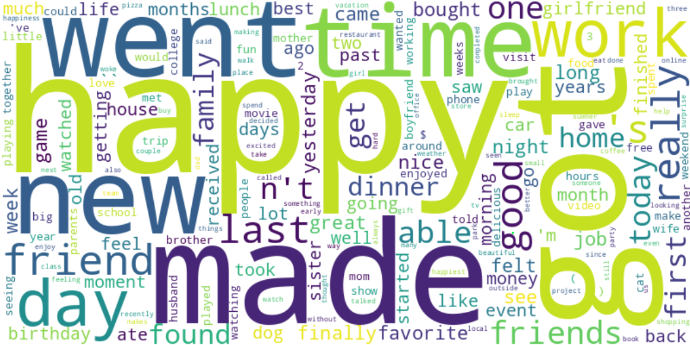
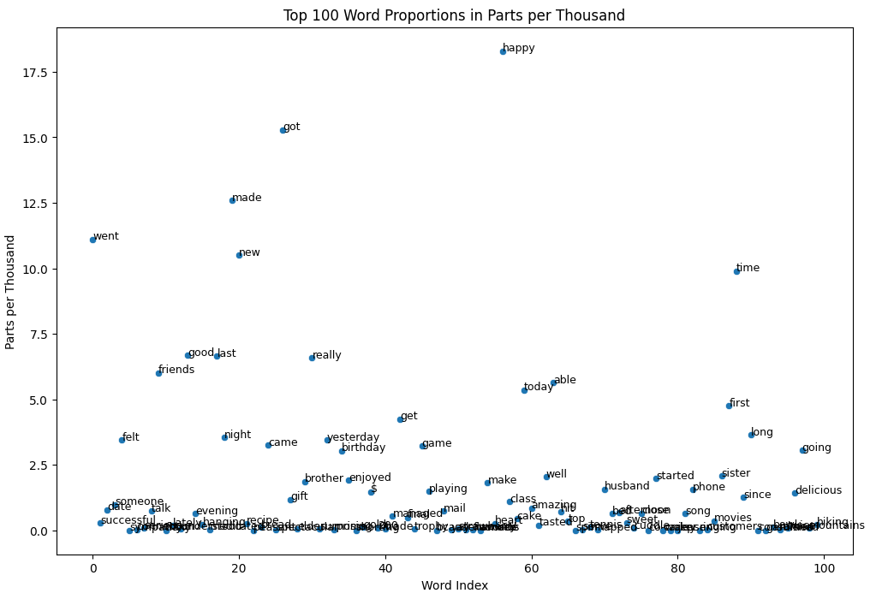
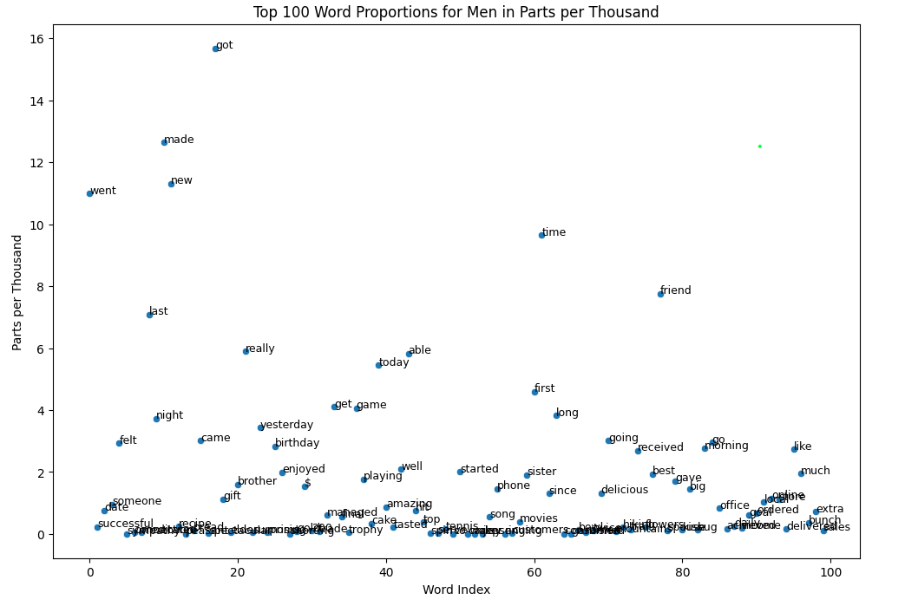
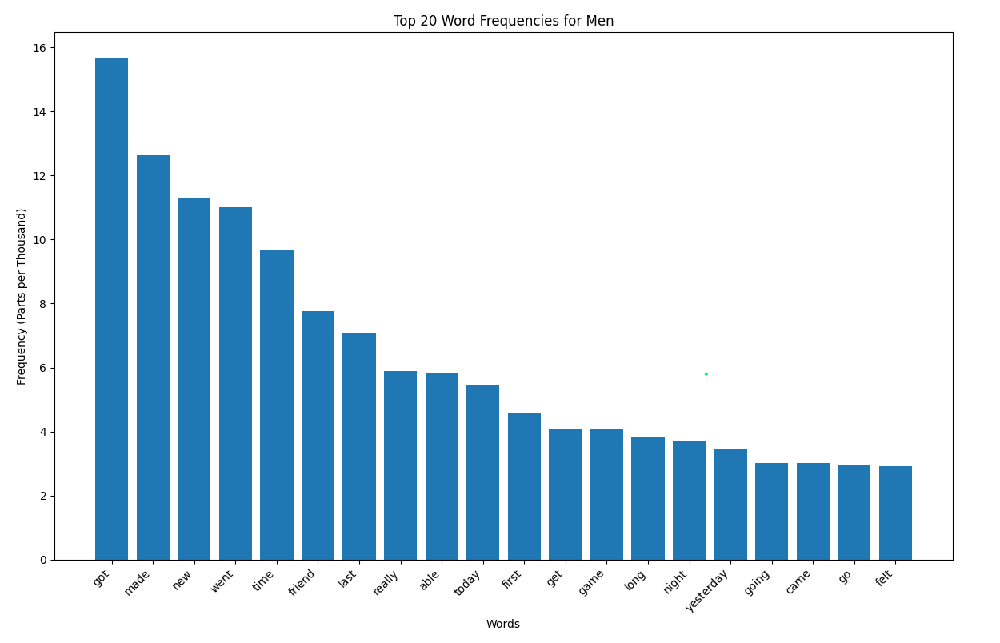
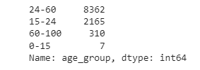
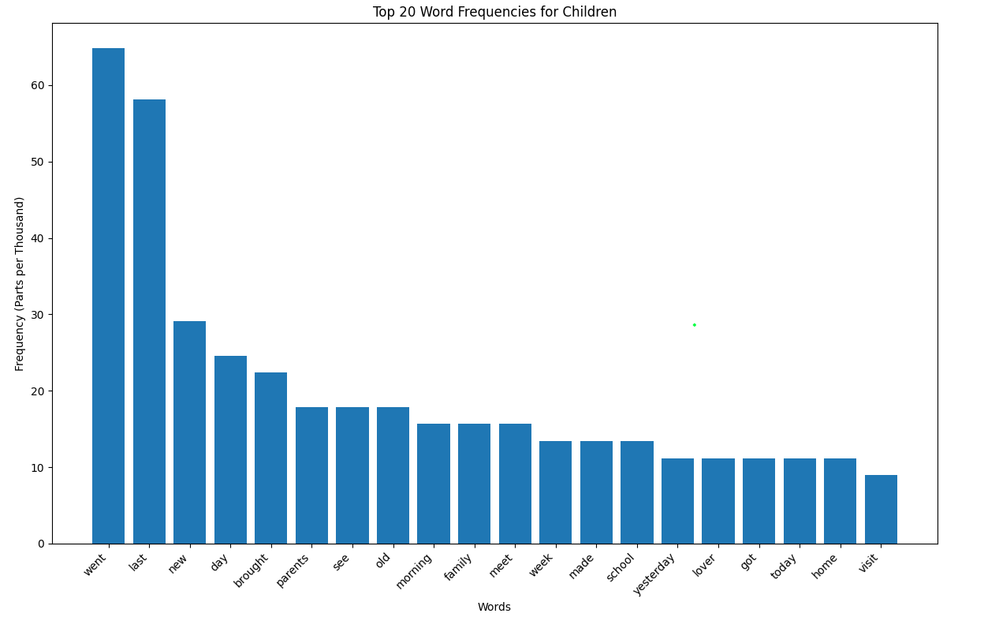
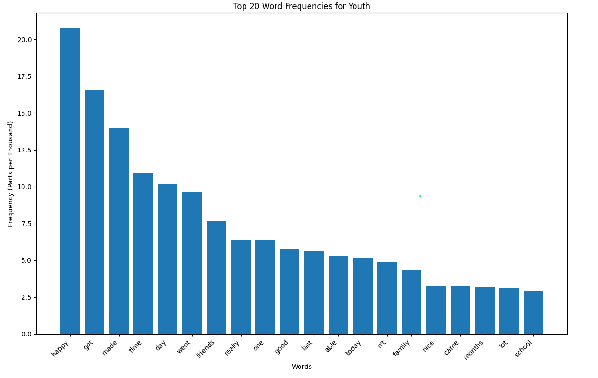
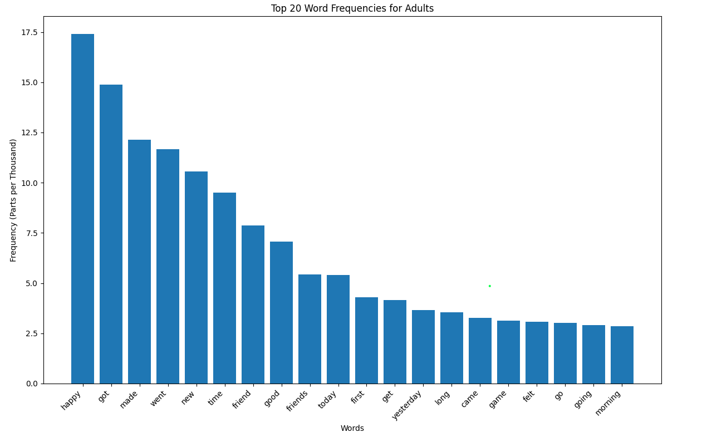
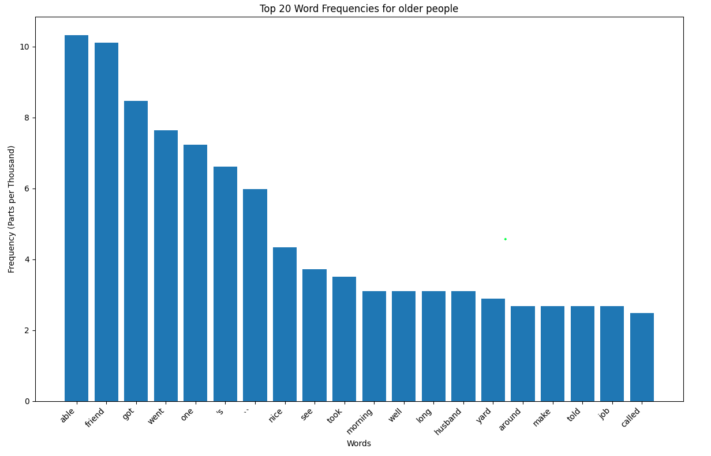

## Applied Data Science @ Columbia
## STAT GR5243/GU4243 Spring 2024 
### Project 1 What made people without children happy in their life?

### Background
I learned through [sample project](https://tzstatsads.github.io/tutorials/proj1_jiaqianyu.html)  that the HAPPY WORD for parents is mostly related to children. It is well known that the birth rate in developed countries goes down. Therefore, I began to wonder what people would be happy about if they didn't have children. The data comes from [HappyDB](https://rit-public.github.io/HappyDB/), which is "a corpus of 100,000 crowd-sourced happy moments". Participants were given a simple *task*:

Data from the HappyDB project can be found on [GitHub](https://github.com/rit-public/HappyDB/tree/master/happydb/data). Before carrying out any analysis, you should read the [description of the data files](https://github.com/rit-public/HappyDB).

Before getting into the questions, I processed the raw data for convinient coding later.

I remove stop words, find target people I am looking for in this project, and processe text with demographic information in [‘demographic.csv’](../data/demographic.csv).

### Q1: What would people without children be happy about?

To solve the question, I define people in ‘demographic.csv’ file is childless if 'parenthood' column is n. Then I calculate the parts per thousand(we use ppt instead later) of the number of times for top 100 word occurs in all the words. The following images show the ppt of each word.

We found that for people without children, as we previously defined them, happy moments would often be characterized by the words 'made', 'got', 'went', 'new', 'friend'.

I think for people who don't have kids, there's a good chance they're happy when they get something new, make something new, or go somewhere new.

This result can be shown more obviously by the words frequency bar charts below.

When comparing the above bar chart with the 'Word Frequency in Happy Moments for mothers / fathers' bar chart in project ['Mom, wish you happy everyday!'](https://tzstatsads.github.io/tutorials/proj1_jiaqianyu.html), I found that there is a significant difference in the things that people with children are happy about compared to people without children.

From the bar chart, 'got', 'made', 'went', 'new' reflect that people without children **like new things**. 'good', 'last', 'really' shows that they are happy with **the things they are lucky to have**. 'friends', 'game' reflects that they are happy **when they talk about friends and games**.' today', 'yesterday' shows that they are happy **when they are closer to the present**.

For me personally, if I didn't have kids in the future, I want to know what will make me happy. So, analyzing this further, do men and women without children differ on the word in happy moment?

### Do men and women without kids have different happy moments?

I solve this problem by distinguishing between men and women in demographic information. In [‘demographic.csv’](../data/demographic.csv), if gender column equals to m, he is male. If gender column equals to f, she is female. I make two graph of Top 100 Word proportions for Men and Women respectfully.

Comparing the two images, we see that in the top 6 - top 10 words, males and females appear differently. By plotting the bar chart separately, we can see the results more clearly.

Comparing the differences between the two bar graphs, I found that Men's happy moments are more in 'first', 'last' and 'game', while Women's happy moments are in 'boyfriend', 'husband', 'family', and 'sister'. **This interesting phenomenon illustrates how childless women derive pleasure from those close to them, while childless men derive more pleasure from themselves.**

But, as far as I can remember, my grandparents and I had different interests. So, word in happy moment should be different too?

Next, I'd like to take the analysis of the people without children a step further. I want to classify people by age group and study why people are happy between different age groups.

### Q3: Do people of different ages have different words in happy moment?

We segmented the data by United Nations categorization of age groups.

0-15 : child

15-24 : [youth](https://www.un.org/development/desa/youth/what-we-do/faq.html)

24-60 : adult

60+ (60-100 in this project) : [older person](https://emergency.unhcr.org/entry/43935/older-persons)

As I processed the data, I realized that the sample in age 0-15 group is quite small, so it may not generate the correct conclusions in that group.

I make the bar chart for each category respectfully.

Comparing these 4 bar charts for different age groups, I found that the Children group would be happy for talking about family and school. The Youth group would be happy for new things, but family and school are also represented in the top 20. The Adults group is happy almost exclusively because of new things. The Older people group is happy because of their friends and having the ability to do things.

**Each group has a portion of overlapping happy words, but they vary in weights at each age.**

### Conclusions

1.   People without children like new things, are happy with the things they are lucky to have, are happy when they talk about friends and games, and are always happy about the latest thing.
2.   Women without children derive pleasure from those close to them, while Men without children derive more pleasure from themselves
3.   Each group has a portion of overlapping happy words, but they vary in weights at each age.

### Useful resources

##### R pakcages
* R [tidyverse](https://www.tidyverse.org/) packages
* R [tidytext](https://cran.r-project.org/web/packages/tidytext/vignettes/tidytext.html)
* [Text Mining with `R`](https://www.tidytextmining.com/)
* R [DT](http://www.htmlwidgets.org/showcase_datatables.html) package
* R [tibble](https://cran.r-project.org/web/packages/tibble/vignettes/tibble.html)
* [Rcharts](http://rcharts.io/gallery/), quick interactive plots
* [htmlwidgets](http://www.htmlwidgets.org/), javascript library adaptation in R. 

##### Project tools
* A brief [guide](http://rogerdudler.github.io/git-guide/) to git.
* Putting your project on [GitHub](https://guides.github.com/introduction/getting-your-project-on-github/).

##### Examples
+ [Topic modeling](https://cran.r-project.org/web/packages/topicmodels/vignettes/topicmodels.pdf)
+ [Clustering](http://www.statmethods.net/advstats/cluster.html)
+ [Sentiment analysis of Trump's tweets](https://www.r-bloggers.com/sentiment-analysis-on-donald-trump-using-r-and-tableau/)

##### Tutorials

For this project we will give **tutorials** and give comments on:

- GitHub
- R notebook
- Example on sentiment analysis and topic modeling

